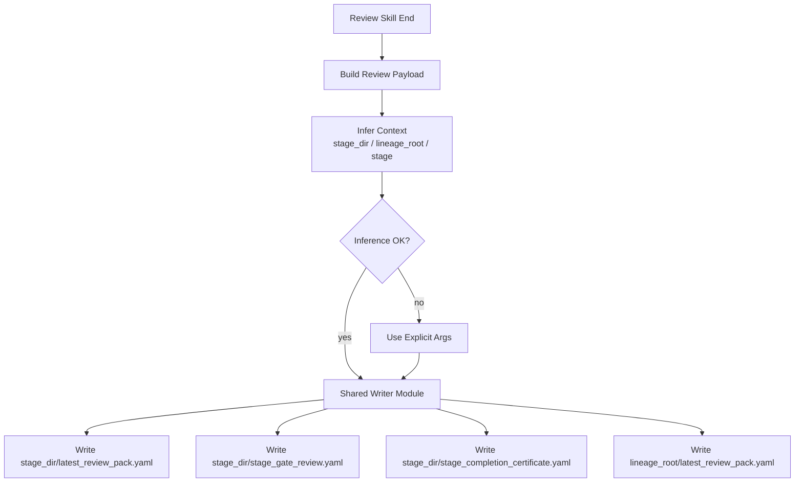

# Closure Artifact Writer Design

**Date:** 2026-03-25  
**Status:** Draft approved for direction  
**Scope:** `Codex-only`, `first-wave stages = Mandate / Data Ready / Signal Ready`

## Goal

把当前 stage review skill 系统里“closure artifacts 只是 prompt 里要求写”的状态，升级成真正可写盘、可复用、可审计的 shared writer。

第一版要解决的问题很明确：

- review skill 在执行末尾可以直接触发 closure artifact 写盘
- 写盘逻辑不复制到每个 skill 中，而是走一个共享 writer 模块
- closure artifacts 同时满足 `stage 内正式落盘` 和 `lineage 根 latest 镜像`
- writer 能优先从当前目录自动推断 `lineage / stage / stage_dir`，失败时退回显式参数

## Non-Goals

第一版不做下面这些事情：

- 不做完整研究运行时 CLI
- 不做所有 stage 的 closure schema 全覆盖
- 不做 review finding 的自动抽取或自动判决
- 不做 stage artifact resolver 的完整实现
- 不做对话日志归档

## Recommended Architecture

采用 `review skill inline trigger + shared writer module`。

### Why Not Pure Inline

如果每个 review skill 自己拼 YAML：

- 3 个 stage 很快漂移
- verdict vocabulary 会失控
- schema 很难统一演进

### Why This Design

本方案兼顾三件事：

1. 触发方式符合当前 workflow
   review skill 在执行末尾直接写
2. 实现方式保持共享
   skill 不负责自己拼 closure schema
3. 后续可扩展
   后面新增 `train/test/backtest/holdout/shadow` 只需要扩 schema 和 stage adapter

## Closure Artifact Set

第一版 writer 负责写 4 份文件。

### Stage Directory Writes

写入当前 `stage_dir`：

- `latest_review_pack.yaml`
- `stage_gate_review.yaml`
- `stage_completion_certificate.yaml`

### Lineage Root Mirror

写入当前 `lineage_root`：

- `latest_review_pack.yaml`

这里的 lineage 根文件不是第二份独立事实来源，而是“最新 review 聚合镜像”，方便上层流程快速发现最近一次 review 结论。

## Path Strategy

### Default Behavior

优先自动推断：

- `lineage_id`
- `stage`
- `stage_dir`
- `lineage_root`

### Fallback Behavior

如果推断失败，则允许显式传参：

- `--lineage-id`
- `--stage`
- `--stage-dir`
- `--lineage-root`

### Inference Rule

第一版约定推断目标目录形状类似：

```text
outputs/<lineage_id>/<stage_name>/
```

从当前工作目录开始向上回溯：

1. 找到当前 stage 目录
2. 找到 stage 上一级作为 lineage 根
3. 用 stage 目录名映射当前 stage key

如果当前目录不在这样的 lineage 目录树下，则必须显式传参。

## Input Model

writer 不自行判断业务结论。它只接受一个标准化 payload。

### Shared Input Payload

第一版 payload 建议包含：

- `lineage_id`
- `stage`
- `stage_display_name`
- `review_scope`
- `stage_status`
- `final_verdict`
- `rollback_stage`
- `allowed_modifications`
- `downstream_permissions`
- `required_inputs_checked`
- `required_outputs_checked`
- `blocking_findings`
- `reservation_findings`
- `info_findings`
- `residual_risks`
- `evidence_links`
- `reviewer_identity`
- `review_timestamp_utc`
- `contract_source`
- `checklist_source`

## Output Model

### 1. `latest_review_pack.yaml`

这是 findings substrate。  
应偏向 reviewer 视角，记录：

- 本次 review 面向哪个 stage
- blocking / reservation / info findings
- evidence 摘要
- verdict 摘要

### 2. `stage_gate_review.yaml`

这是 “review 发生过” 的 proof artifact。  
应偏向过程记录，记录：

- 谁执行了 review
- 用了哪版 contract / checklist
- 审查范围是什么
- 输入输出检查是否完成
- verdict 是什么

### 3. `stage_completion_certificate.yaml`

这是 machine-readable closure certificate。  
应偏向“为什么可以正式关闭或为什么不能关闭”，并对齐现有模板：

- 基本信息
- 输入输出核对
- 六联可信完成标准的最小摘要
- checklist 摘要
- final verdict
- rollback / child lineage / downstream permissions

## Writer Flow



## Shared Module Boundaries

建议新增一个 shared writer 模块，例如：

```text
tools/review_skillgen/
  closure_writer.py
  closure_models.py
  context_inference.py
```

### `context_inference.py`

负责：

- 从 cwd 推断 `stage_dir`
- 推断 `lineage_root`
- 推断 `stage`
- 推断失败时抛出明确错误

### `closure_models.py`

负责：

- 定义 shared payload 结构
- 定义 3 类 closure artifact 的最小 schema

### `closure_writer.py`

负责：

- 将 shared payload 映射成 3 类 stage files
- 同时写 lineage 根 `latest_review_pack.yaml`
- 统一时间戳、键顺序、文件编码

## Integration Strategy

第一版不要求 review skill 已经真的执行写盘。  
但设计上必须为下一步接入留出明确接口：

- `write_closure_artifacts(payload, cwd=None, explicit_context=None)`

skill 末尾只需要做两件事：

1. 构造 payload
2. 调 shared writer

## Schema Discipline

第一版必须遵守：

- 统一使用现有 status vocabulary  
  `PASS / CONDITIONAL PASS / PASS FOR RETRY / RETRY / NO-GO / GO / CHILD LINEAGE`
- 不新增第二套 verdict 词表
- 不把 `latest_review_pack.yaml` 当成 completion certificate
- 不把 lineage 根镜像当作 stage-level 真值

stage-level 真值仍然在：

- `<stage_dir>/latest_review_pack.yaml`
- `<stage_dir>/stage_gate_review.yaml`
- `<stage_dir>/stage_completion_certificate.yaml`

## First-Wave Support

第一版只要求支持：

- `mandate`
- `data_ready`
- `signal_ready`

原因：

- 这 3 个 stage 已经有最完整的 gate/checklist 结构
- 它们是后续 `train/test/backtest/holdout/shadow` 的上游基线

## Success Criteria

如果设计正确，第一版实现完成后应满足：

- review skill 可以在末尾调用 shared writer
- writer 能优先自动推断上下文，失败再显式传参
- stage 目录会生成 3 个正式 closure files
- lineage 根会保留 `latest_review_pack.yaml` 的最新镜像
- output schema 不引入第二套 verdict 体系

## Next Step

下一步写 implementation plan，拆成：

1. 定义 payload 与 output models
2. 实现 context inference
3. 实现 closure writer
4. 为 first-wave stages 写测试
5. 把 writer 接到 review skill generator 生成内容中
