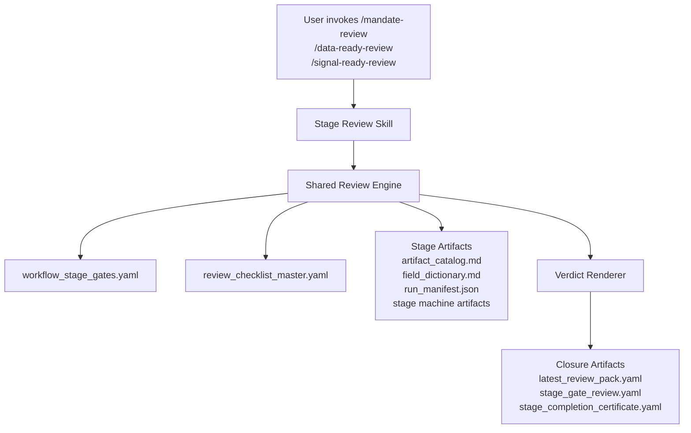

# Codex Stage Review Skill System Design

**Date:** 2026-03-25
**Status:** Draft approved for direction
**Scope:** `Skill-first`, `Codex-only`, first wave covers `Mandate`, `Data Ready`, `Signal Ready`

## Goal

把现有的量化研究 SOP、stage gates 和 review checklist 从“文档规范”提升为“Codex 可执行的 stage review skill 系统”。

第一版只解决一件事：

- 让 agent 能基于统一 contract 审查某个 stage 是否做到位；
- 给出统一 verdict；
- 生成统一 closure artifacts；
- 为后续扩展到 `Train/Test/Backtest/Holdout/Shadow` 留出结构。

## Non-Goals

第一版不做下面这些事情：

- 不做完整研究运行时 CLI
- 不做数据计算、信号生成、回测执行
- 不做 stage authoring/build skills
- 不做多宿主兼容，先只服务 Codex

## Recommended Architecture

采用 `3 个显式 stage review skills + 1 个共享 review engine` 的混合结构。

### User-Facing Skills

- `/mandate-review`
- `/data-ready-review`
- `/signal-ready-review`

这些 skills 面向用户暴露，职责是：

- 明确当前在审哪个 stage
- 加载对应 contract 和 checklist
- 读取当前 stage 的证据产物
- 输出统一 verdict 和 closure artifacts

### Shared Review Engine

共享 review engine 不一定暴露为单独 slash command，但它是所有 stage review skill 的公共执行内核。

它负责：

- 读取 stage contract
- 读取 stage checklist
- 定位 lineage/stage artifacts
- 区分 `formal gate` 与 `audit-only`
- 统一渲染 `PASS / CONDITIONAL PASS / PASS FOR RETRY / RETRY / CHILD LINEAGE`
- 生成 closure artifacts

## Why Shared Inputs Exist

共享输入的作用不是“多一个配置层”，而是把审查依据从 skill 文本中抽离出来，变成可复用、可审计、可扩展的数据源。

它解决 4 个问题：

1. 防止不同 stage skill 各说各话
2. 让 skill 成为执行器，而不是规则本体
3. 后续扩展新 stage 时不必重写一套 prompt
4. 让 gate decision 可以追溯到具体 contract 和 checklist 条目

## Shared Inputs

共享输入分两类。

### 1. Rule Inputs

这些文件定义“该审什么”：

- `docs/gates/workflow_stage_gates.yaml`
- `docs/check-sop/review_checklist_master.yaml`

### 2. Evidence Inputs

这些文件定义“拿什么证据来审”：

- 当前 stage 的 `artifact_catalog.md`
- 当前 stage 的 `field_dictionary.md` 或 `*_fields.md`
- `run_manifest.json` 或等价执行账本
- `gate_decision.yaml` 或等价 gate 文档
- `stage_gate_review.yaml`、`stage_completion_certificate.yaml` 的历史版本
- stage-specific 机器产物

例如：

- `Mandate` 主要看 `time_split.json`、`parameter_grid.yaml`、`run_config.toml`
- `Data Ready` 主要看 `dataset_manifest.json`、`qc_report.parquet`、`aligned_bars/`、`rolling_stats/`
- `Signal Ready` 主要看 `param_manifest.csv`、`timeseries/`、`signal_fields_contract.md`

## Shared Outputs

每次 review 结束后，统一生成或更新以下 closure artifacts：

- `latest_review_pack.yaml`
- `stage_gate_review.yaml`
- `stage_completion_certificate.yaml`

必要时补充：

- `residual_risks.md`
- `retry_record.yaml`
- `child_lineage_recommendation.md`

## Core Review Flow

所有 stage review skills 走同一顺序：

1. 确认当前 stage
2. 从 `workflow_stage_gates.yaml` 读取该 stage 的 contract
3. 从 `review_checklist_master.yaml` 读取该 stage 的 review checklist
4. 定位当前 lineage/stage 下的 evidence artifacts
5. 检查 `required_inputs / required_outputs`
6. 先判 `formal gate`
7. 再记录 `reservation / info / audit-only`
8. 输出统一 verdict
9. 写 closure artifacts

## Structure Diagram



## Responsibility Boundaries

### `/mandate-review`

重点核查：

- 主问题、时间边界、Universe 是否冻结
- 参数字典、字段字典、机制模板是否齐全
- 是否存在后验改题迹象

### `/data-ready-review`

重点核查：

- 时间对齐、QC、缺失语义、去重规则
- dataset manifest 和 universe exclusion 记录
- 是否存在静默补值、静默吞掉坏数据、时间主键混乱

### `/signal-ready-review`

重点核查：

- signal contract、schema、param_id 身份
- timeseries 是否显式物化
- 是否越权给出白名单、收益、test/backtest 级别结论

## Proposed Repo Layout

第一版推荐新增以下结构：

```text
docs/
  plans/
    2026-03-25-codex-stage-review-skill-system-design.md

.agents/
  skills/
    qros-mandate-review/
      SKILL.md
    qros-data-ready-review/
      SKILL.md
    qros-signal-ready-review/
      SKILL.md

tools/
  review_engine/
    load_stage_contract.*
    load_stage_checklist.*
    resolve_stage_artifacts.*
    evaluate_formal_gate.*
    render_verdict.*
    write_closure_artifacts.*

templates/
  skills/
    review-stage/
      SKILL.md.tmpl

scripts/
  gen-codex-skills.*
```

说明：

- `.agents/skills/` 放用户可调用的 Codex skills
- `tools/review_engine/` 放共享逻辑
- `templates/skills/` 放可生成的 skill 模板
- `scripts/gen-codex-skills.*` 负责从模板和 schema 生成 skills

## Design Choice

本方案不推荐第一版直接做单一的 `/stage-review` 动态入口。

原因：

- 用户可见性差
- 容易把 stage 上下文说模糊
- prompt/debug 成本更高
- 第一版最需要的是“明确、稳定、低歧义”的入口

因此先用显式的 3 个 skills，内部再共享动态 engine。

## Expansion Path

当第一版稳定后，扩展顺序建议是：

1. `train-calibration-review`
2. `test-evidence-review`
3. `backtest-ready-review`
4. `holdout-validation-review`
5. `shadow-audit`

之后再考虑是否增加统一入口：

- `/stage-review --stage mandate`

## Success Criteria

如果第一版设计成功，应满足：

- 用户能明确调用 3 个 stage review skills
- 3 个 skills 使用同一套 rule inputs 和 verdict vocabulary
- review 结果能写成统一 closure artifacts
- 后续新增 stage 时，主要新增 schema 和 skill 模板，而不是重写引擎

## Next Step

下一步不是直接写实现代码，而是写 implementation plan，把：

- 文件路径
- skill 模板结构
- shared review engine 组件
- closure artifact 写入逻辑
- 测试与验证路径

拆成可执行任务。
