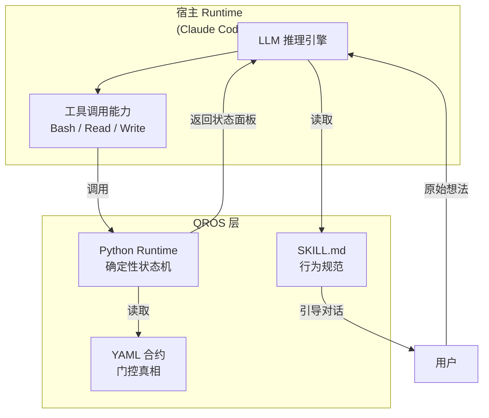
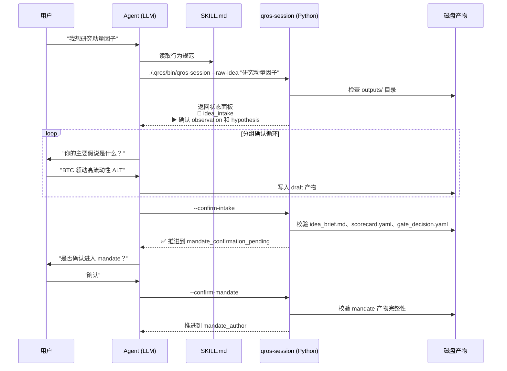
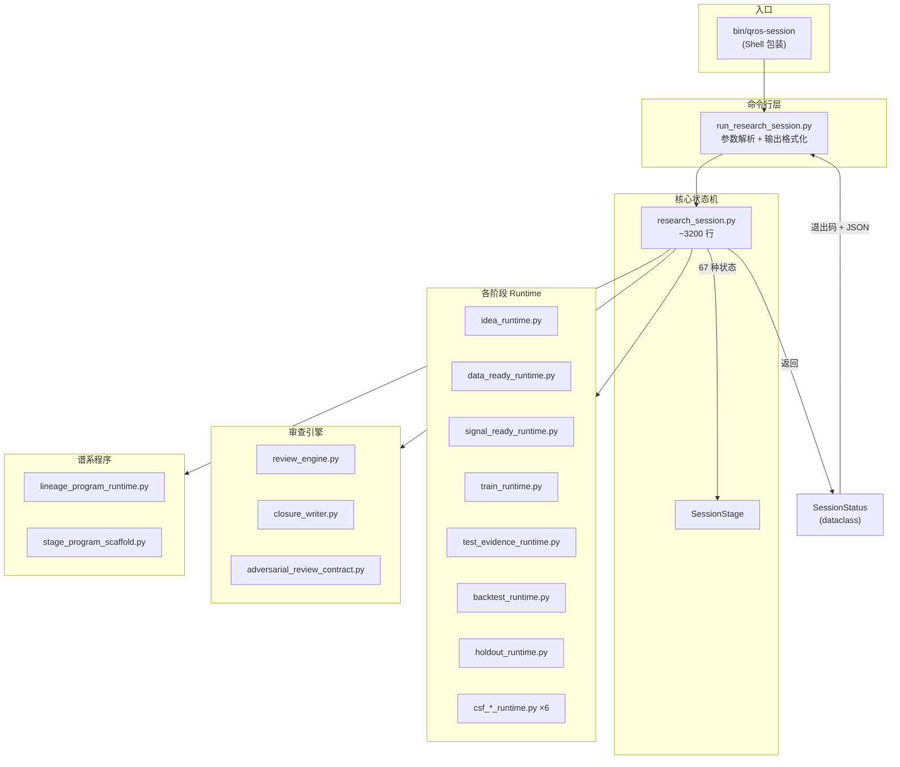
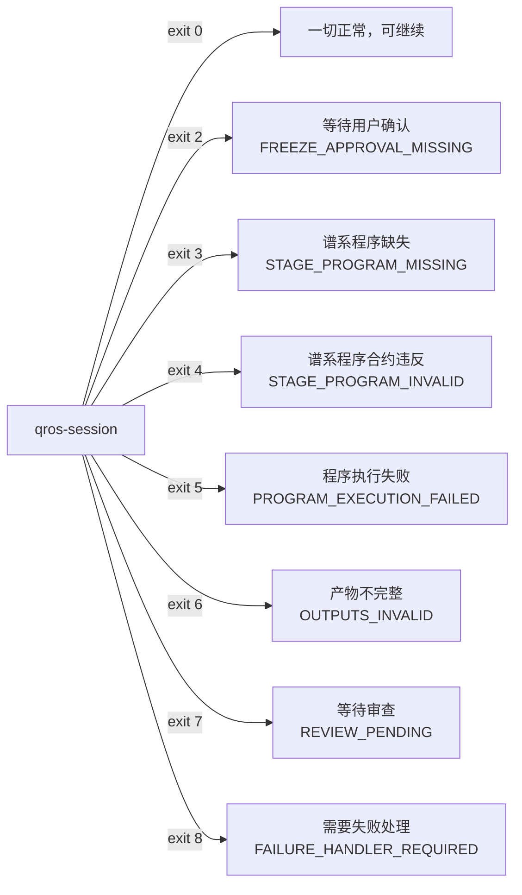
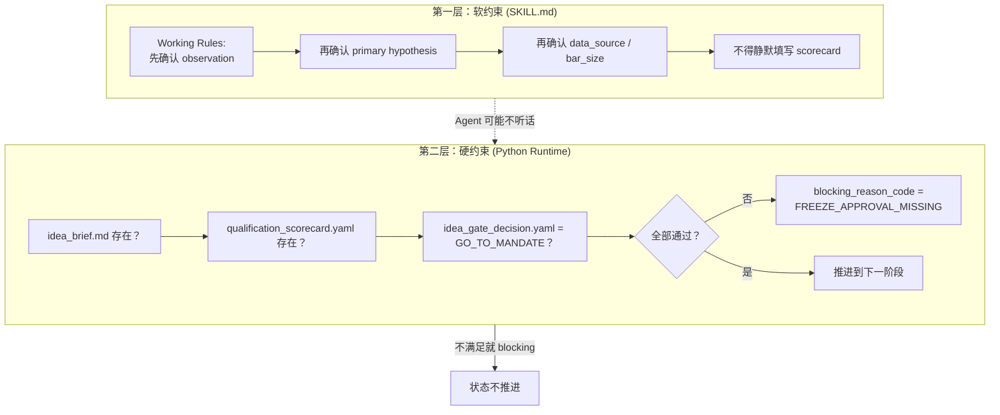
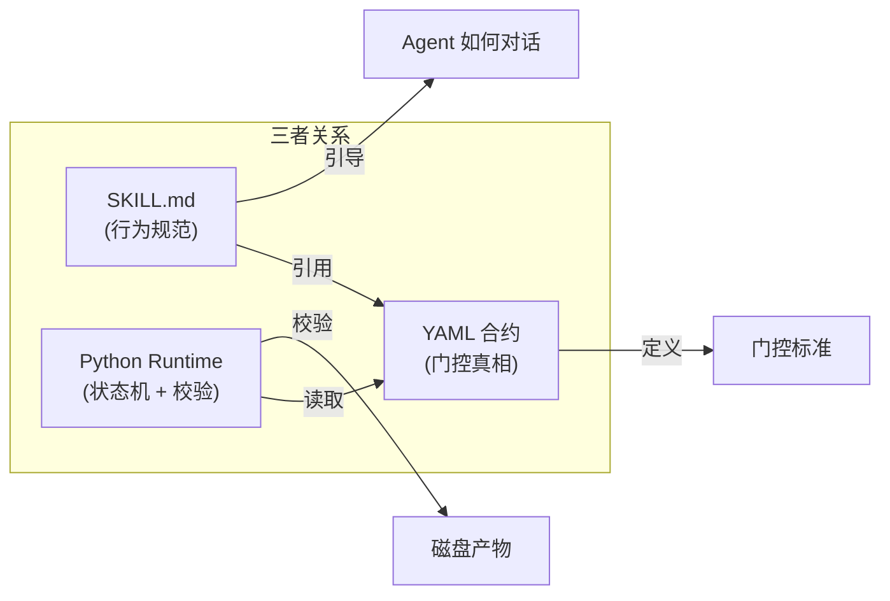
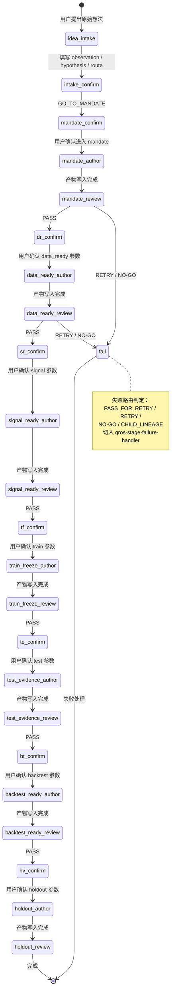
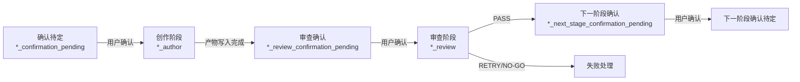
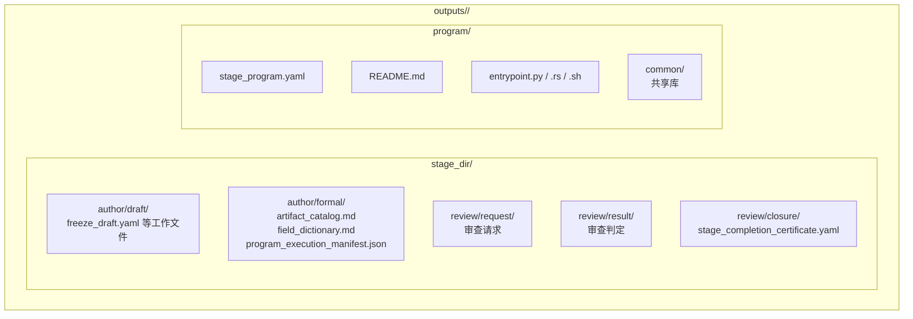
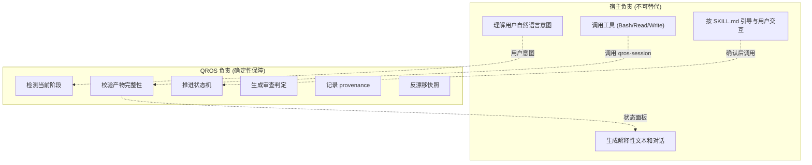

# QROS 工作原理：两层运行时架构

本文解释 QROS 的运行机制——宿主 AI Runtime（Claude Code / Codex）与 QROS Python Runtime 如何协作，以及研究流程是如何被推进和约束的。

如果你是第一次接触 QROS，建议先读 [README](../../README.md) 了解项目定位，再回来理解运行机制。

---

## 整体架构：宿主 + QROS



**核心分工**：

| 维度 | 宿主 Runtime | QROS Runtime |
|------|-------------|--------------|
| 本质 | LLM 推理引擎 + 工具调度 | 确定性状态机 + 合约执行器 |
| 职责 | 理解意图、生成文本、调用工具 | 判断阶段、校验产物、推进状态 |
| 确定性 | 不确定（LLM 输出可变） | 完全确定（同输入同输出） |
| 存储 | 对话历史在内存 | 状态在磁盘 YAML/Markdown 文件 |
| 失败模式 | 理解偏差、幻觉 | 文件缺失、合约违反 |

---

## 执行流程：一次完整调用



每个阶段都遵循相同的循环：

```
Agent 对话 → 调用 runtime → runtime 校验磁盘产物 → 返回状态 → Agent 继续对话
```

---

## QROS Runtime 内部结构



### 各模块职责

| 模块 | 职责 |
|------|------|
| `research_session.py` | 核心状态机：检测当前阶段、推进状态、返回 SessionStatus |
| `*_runtime.py` | 各阶段脚手架：生成 freeze draft、校验冻结组、检查产物 |
| `review_engine.py` | 审查引擎：加载合约、检查产物、生成审查判定 |
| `lineage_program_runtime.py` | 谱系程序：验证 stage_program.yaml、执行 entrypoint、记录 provenance |
| `run_research_session.py` | CLI 入口：参数解析、调用核心状态机、格式化输出面板 |

---

## 退出码：runtime 与 Agent 的通信协议

`qros-session` 通过退出码向 Agent 传递语义化信号：



Shell 包装器将退出码 2-8 映射为 `exit 0`（非致命阻塞），只有真正的系统错误才传递非零退出码。Agent 不会因为阻塞而报错，而是读到状态面板后知道该做什么。

---

## 双层防护：软约束 + 硬约束



- **软约束**（SKILL.md）告诉 Agent "你应该这样做"——但 LLM 可能跳步
- **硬约束**（Python Runtime）检查磁盘产物 "文件在不在？合约满不满足？"——不满足就阻塞

即使 Agent 试图跳步，runtime 发现磁盘上缺文件就不会推进状态。这就是 QROS 的核心保障：**用确定性代码约束不确定性 AI**。

---

## SKILL.md 的角色：Agent 操作手册

SKILL.md 不执行任何代码。它是一份给 LLM 的行为规范，告诉 Agent：

1. 什么时候该停下来问用户
2. 按什么顺序确认冻结组
3. 什么条件下才能推进到下一阶段
4. 什么时候必须切换到失败处理



合约 YAML 是三者共享的真相来源：runtime 读它做校验，SKILL.md 读它引导对话，测试读它验证一致性。

---

## 状态生命周期：从 idea_intake 到 holdout_validation



每个阶段都经过相同的子循环：



---

## 产物目录结构

每次 runtime 校验和推进时，检查的是用户研究仓库中的磁盘产物：



Runtime 的校验逻辑是：**产物文件存在于磁盘 + 内容符合合约 = 阶段完成**。不依赖对话历史，不依赖 Agent 记忆。

---

## 与宿主 Runtime 的边界



关键边界原则：

1. **QROS 不做推理**——不替用户判断假说是否合理，只校验产物是否完整
2. **宿主不做校验**——LLM 不自己判断阶段是否完成，而是调 runtime 检查
3. **产物优于记忆**——正式结论依赖磁盘文件，不依赖对话历史
4. **合约是共享真相**——runtime 和 SKILL.md 都从同一份 YAML 合约读取门控标准

---

## 延伸阅读

- [阶段冻结字段说明](stage-freeze-group-field-guide.md) — 各阶段冻结组的字段解释
- [QROS 统一研究会话说明](qros-research-session-usage.md) — qros-research-session 的使用方法
- [研究工作流 SOP](../sop/main-flow/research_workflow_sop.md) — 各阶段操作规范
- [验证层级说明](qros-verification-tiers.md) — smoke / full-smoke 验证
