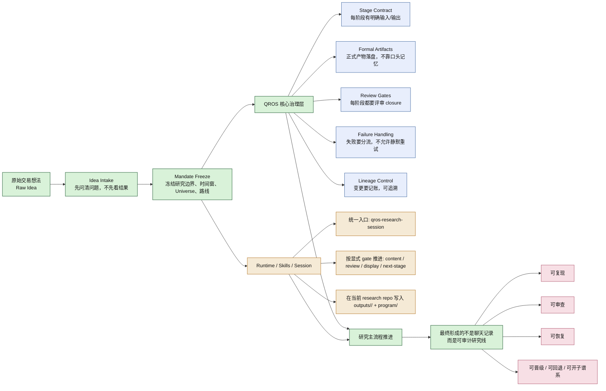
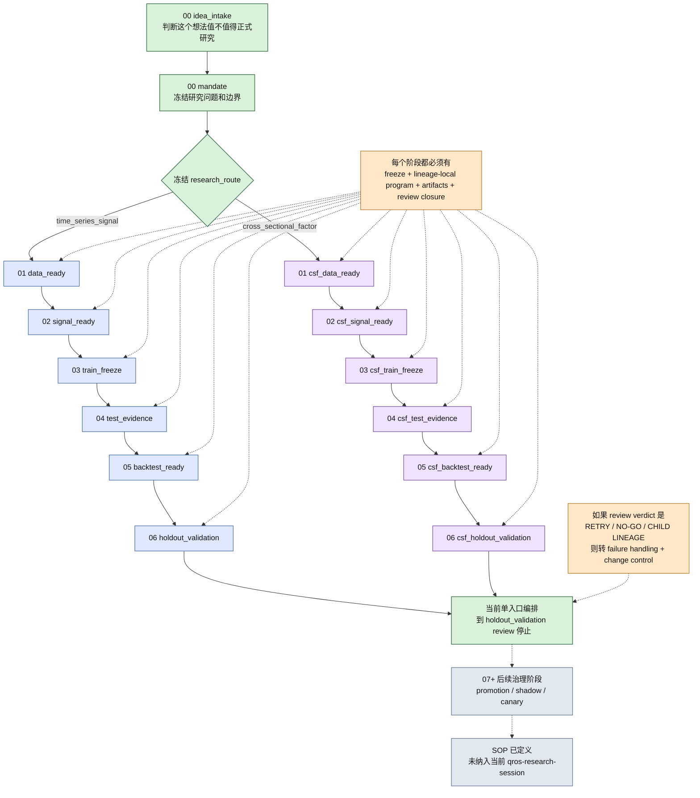

# QROS

## 一句话定位

> QROS 不是“某个策略代码仓”，而是一个把量化研究从模糊想法推进成可冻结、可复现、可审查、可回退研究线的流程操作系统。

## 它是什么

QROS 不是一个具体策略仓，也不是一个普通的研究脚手架。它更接近一个面向 agent 和研究团队的研究治理系统，用来把原始交易想法推进成正式研究线，并要求这条研究线在全过程中保持边界清晰、产物可追溯、结论可审查。

它主要做两件事：

1. 规定研究应该如何被定义、冻结、审查、推进和回退。
2. 要求 agent 在真实 research repo 中物化各阶段正式 artifact，而不是停留在聊天记录、口头判断或临时解释上。

## 它解决什么问题

传统研究流程里最常见的混乱包括：

- 想法、边界和结果混在一起。
- 之前回测出很多翻倍的策略，但是我始终持有怀疑态度
- 看过结果之后再改研究
- 数据、信号、训练、测试、回测彼此穿插，缺少明确边界。
- 失败后静默重试，没有正式记录。
- 最终只能保留“结论”，却说不清结论依赖了哪些证据和哪些回退路径。

QROS 的做法是把这些问题拆成阶段治理：

- 从 `idea_intake` 开始，先把研究问题问清楚。
- 进入 `mandate` 之后，再冻结研究边界、时间窗、Universe、数据口径和执行合同。
- 此后按阶段推进，每个阶段都必须交付正式 artifact。
- 每个阶段都必须经过 review closure。
- 一旦 review verdict 不是正常放行，就进入 failure handling，而不是默默重跑。

## 项目总览图

## 主流程图

## 它怎么运转

研究从 `idea_intake` 开始。这个阶段先确认 observation、hypothesis、scope、data source、route assessment 和 kill criteria，目标不是立刻给出结果，而是判断这个想法是否具备正式研究资格。

只有通过 intake gate，研究才会进入 `mandate`。在这里，研究问题、时间边界、Universe、数据合同、参数边界和执行合同会被正式冻结。`mandate` 之后，流程按 `research_route` 分流：`time_series_signal` 进入 `data_ready -> signal_ready -> train_freeze -> test_evidence -> backtest_ready -> holdout_validation`，`cross_sectional_factor` 进入对应的 `csf_*` 独立主线。

当前仓库里，`qros-research-session` 这条 first-wave 单入口编排只覆盖到 `holdout_validation review`。`promotion_decision -> shadow_admission -> canary_production` 这些更后面的治理节点已经在 SOP 中定义，但还没有接入当前 single-entry runtime，所以展示时应把它们理解成后续治理蓝图，而不是今天已经打通的实际编排路径。

无论走哪条路线，阶段推进都依赖四件事：

- freeze approval 和显式 gate，而不是口头默认继续。
- 正式 artifact，而不是空目录、占位文件或口头说明。
- lineage-local stage program 和 provenance，而不是框架仓共享 helper 直接冒充阶段完成。
- review closure，而不是研究员自己宣布通过。
- lineage control 和 failure handling，而不是静默重试或直接改题。

如果展示时有人追问 `research_intent`、`scope_contract`、`delivery_contract` 这些字段到底是什么意思，可以直接打开：

- `docs/experience/stage-freeze-group-field-guide.md`

## 为什么重要

- 对组织，它把研究从个人经验驱动的过程，变成可治理、可审计、可追溯的正式流程。
- 对研究员，它强制区分 hypothesis、data contract、signal contract、test evidence、backtest evidence 和 holdout evidence，减少结果倒推叙事。
- 对开发和 agent，它提供明确的 stage contract、artifact contract、review gate 和 failure routing，使系统知道下一步该写什么、什么时候必须停下来、什么时候必须回退或开子线。

## 思考

- 想法阶段引入多智能体进行讨论 ，想法到问题边界不是人和 Agent 的协作，而是agent 和 agent 之间的辩论，人最终给出裁定
- review 不再是同一个agent , 考虑引入claude opus  ，目前主要依托codex 里的gpt5.4
- 思考整个链路是否存在并行可能性
- 思考每个阶段是否提供更为清晰的报告展示，什么形式
