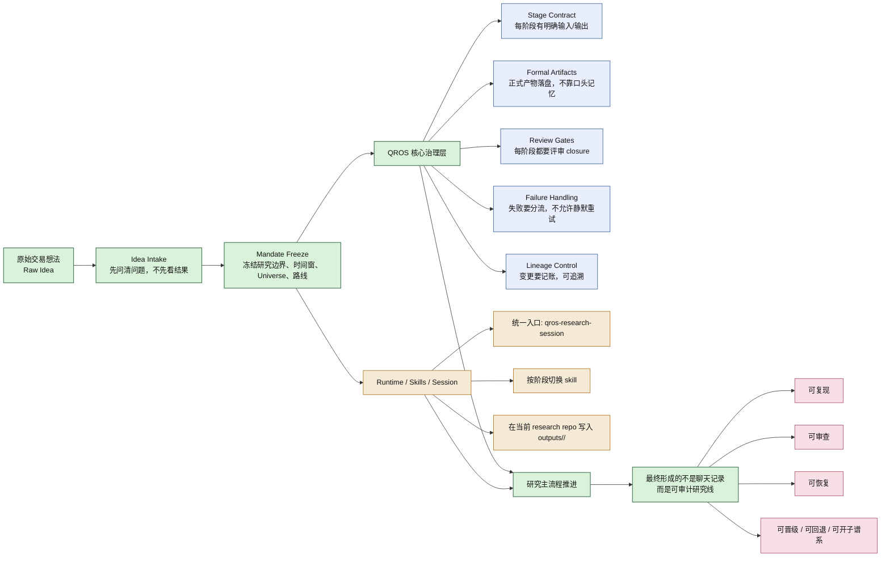
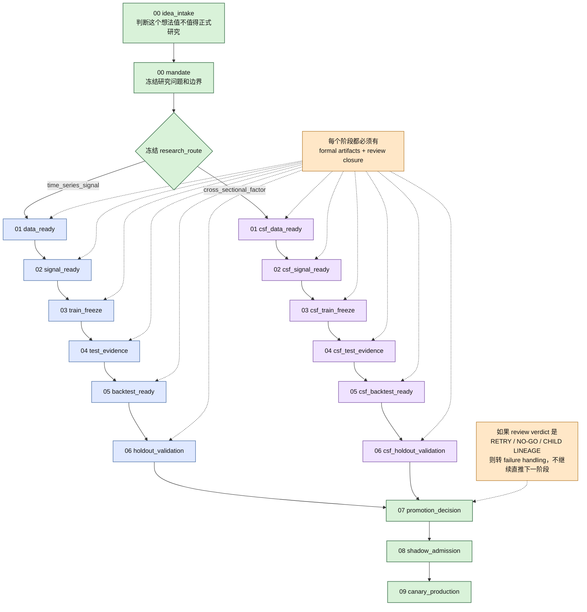

# QROS 项目思路讲解

这份文档适合直接拿来做项目演示。

可直接编辑的图文件在这里：[qros-demo.drawio](/Users/mac08/workspace/web3qt/quant-research-os/docs/show/qros-demo.drawio)

如果只讲一句话：

> QROS 不是“某个策略代码仓”，而是一个把量化研究从模糊想法推进成可冻结、可复现、可审查、可回退研究线的流程操作系统。

## 建议演示顺序

1. 先讲“QROS 是什么”
2. 再讲“QROS 怎么跑起来”
3. 最后讲“为什么它对老板、开发、研究员都重要”

## 一、项目总览图

## 二、主流程图

## 三、怎么讲这个项目

### 先讲定位

这个仓库最容易被误解成“量化策略模板库”，但它其实不是。

它真正做的是两件事：

1. 规定研究必须怎么被定义、冻结、审查和推进
2. 让 agent 在真实 research repo 里把每个阶段的正式产物写出来，而不是停留在聊天和口头判断

### 再讲它解决的问题

传统研究流程常见的混乱是：

- 想法、边界、结果混在一起
- 看了结果再改研究问题
- 数据、信号、训练、回测混着做
- 失败后偷偷重试，没有变更记录
- 最后没人说得清这个结论到底靠什么证据成立

QROS 的做法是把这些问题拆成阶段治理：

- 先 `idea_intake`
- 再 `mandate freeze`
- 再按阶段推进
- 每阶段都要求正式 artifact
- 每阶段都要 review closure
- 失败必须进入 failure handling，而不是默默重跑

### 最后讲它为什么重要

对老板：

- 它把研究从“个人经验驱动”变成“组织可治理流程”
- 能看清一条研究线为什么推进、为什么被拒、为什么回退

对研究员：

- 它强制区分 hypothesis、data contract、signal contract、test evidence、backtest evidence
- 可以避免“先看到结果再回写故事”

对开发和 agent：

- 它明确告诉系统下一步该做什么、该写什么 artifact、什么情况下必须停下来问人
- 可以恢复 session，可以按 stage review，可以做 failure routing

## 四、30 秒版本

QROS 是一个量化研究流程操作系统。它不负责替你保存某个策略本身，而是负责把一个模糊研究想法，经过 intake、mandate、data、signal、train、test、backtest、holdout 这些阶段，变成一条可复现、可审查、可回退的正式研究线。核心不是“算出了什么结果”，而是“这个结果是按什么治理纪律被产生出来的”。

## 五、3 到 5 分钟讲稿

如果我要用最短时间介绍这个项目，我会这样讲：

第一，这个仓库不是一个具体策略仓，也不是一个普通的研究脚手架。它更像一个研究治理系统，专门解决量化研究里最常见的问题，比如边做边改、看完结果再改问题、失败不留痕、流程不可复盘。

第二，QROS 的核心思想是，研究不能靠聊天记录推进，必须靠正式 artifact 推进。一个原始想法先进入 `idea_intake`，先确认 observation、hypothesis、kill criteria 和 scope。只有这个想法值得继续，才进入 `mandate`，把研究边界、时间窗、Universe、参数边界和研究路线冻结下来。

第三，从 `mandate` 之后，流程会按 `research_route` 分成两条线。一条是时序信号路线，走 `data_ready -> signal_ready -> train_freeze -> test_evidence -> backtest_ready -> holdout_validation`。另一条是横截面因子路线，走对应的 `csf_*` 独立阶段。这说明 QROS 并不是只有一条固定研究模板，而是先冻结路线，再按路线执行不同合同。

第四，QROS 每个阶段都强调三件事。第一，要有正式产物，而不是空目录和说明文档。第二，要有 review closure，阶段通过不是自己说了算。第三，失败不能悄悄重试，而是要进入 failure handling，看是允许 retry、必须回退，还是应该开 child lineage。

第五，所以这个项目的价值，不只是帮研究员更规范，也是在帮组织建立研究治理能力。老板看到的是过程可控，研究员得到的是研究纪律，开发和 agent 得到的是清晰的阶段合同和确定的执行入口。

如果用一句话收尾，那就是：QROS 让量化研究从“讨论一个想法”，升级成“经营一条可审计的研究生命线”。

## 六、演示时的建议

如果你现场只讲一页，优先讲“项目总览图”。

如果你有 3 到 5 分钟，建议顺序是：

1. 先讲一句话定位
2. 指着总览图讲治理机制
3. 指着主流程图讲 stage 推进和 route 分流
4. 最后分别点一下老板、研究员、开发能得到什么

如果你要给老板做汇报，可以重点强调这三个词：

- `可治理`
- `可审计`
- `可追溯`

如果你要给开发和研究员讲，可以重点强调这四个词：

- `freeze`
- `artifact`
- `review`
- `lineage`
